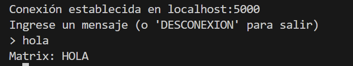
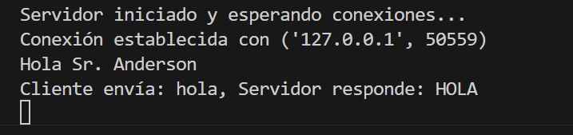

# Proyecto de Comunicación Cliente-Servidor

Este proyecto implementa un sistema cliente-servidor usando Python.

## Requisitos Previos

- Python 3

## Instrucciones de Uso

1. Clonar el repositorio en tu maquina local.
2. Abre una terminal y navega hasta el directorio del proyecto.

### Ejecución del Servidor

Para iniciar el servidor, ejecuta el siguiente comando en la terminal:

```bash
python server.py
```
### Pruebas
Conexion del cliente



Conexion del servidor



Desconexion por cliente


Desconexion del servidor

